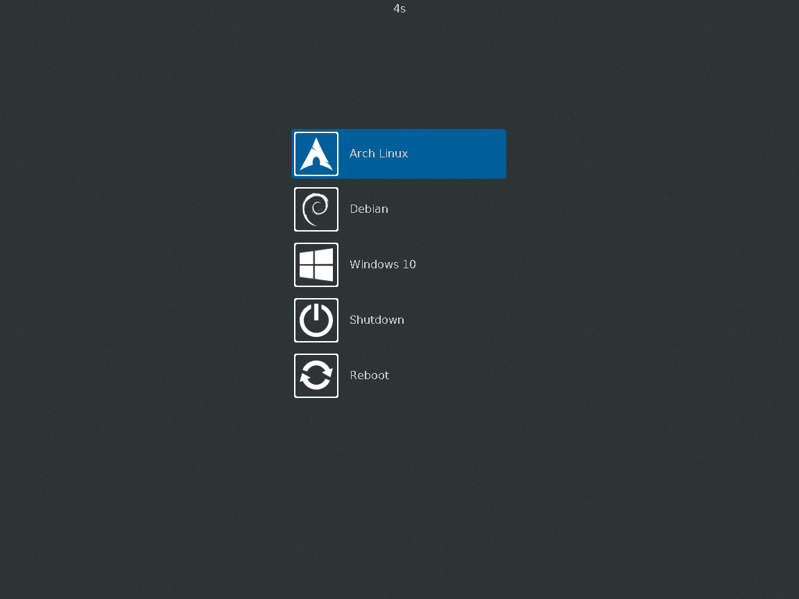

# About

GDM is a theme for the GRUB bootloader aiming to immitate the default appearance of the Gnome Dispaly Manager user login page.

# Installation
To install the theme, place the "gdm" folder in the GRUB themes folder, usually located at `/boot/grub/themes`, E.g.:

    git clone https://github.com/Tomha/GrubThemeGdm
    sudo cp -r GrubThemeGdm/gdm /boot/grub/themes/

**Activating the Theme:**
To use the theme, set the `GRUB_THEME` line in the GRUB config file, usually located at `/etc/default/grub`, e.g.: `GRUB_THEME=/boot/grub/theme/gdm/theme.txt`. Then regenerate the grub config file: `sudo grub-mkconfig -o /boot/grub/grub.cfg`.

**Low Resolution Fix:**
If GRUB defaults to a very low resolution you can try forcing a higher resolution for a better apperance, and to fit more entries on the screen without having to scroll.
1. Reboot into grub and press `c` to get the GRUB command prompt
2. Run `vbeinfo` to list available resolutions
3. Set the `GRUB_GFXMODE` line in the GRUB config file as per above, e.g.: `GRUB_GFXMODE=1600x1200`
